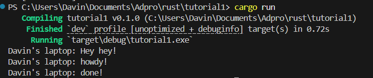

# Reflection Notes

## 1.2 Understanding how it works.

Pada saat spawner menjalankan spawn, dia hanya memberi task kepada executor, tidak sekalian menjalankannya sehingga "Hey hey" akan jalan duluan. Setelah itu, executor.run() baru akan menjalankan task yang diberi oleh spawner.