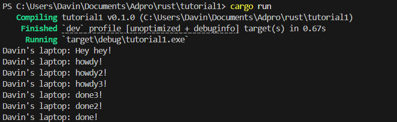
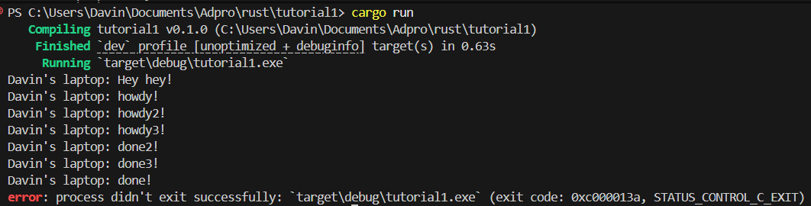

# Reflection Notes

## 1.2 Understanding how it works.

Pada saat spawner menjalankan spawn, dia hanya memberi task kepada executor, tidak sekalian menjalankannya sehingga "Hey hey" akan jalan duluan. Setelah itu, executor.run() baru akan menjalankan task yang diberi oleh spawner.

## 1.3 Multiple spawn and removing drop.

Image sebelum drop nya dihapus ^

Image setelah drop dihapus ^

Ketika perintah drop(spawner) dihapus, executor tidak akan menerima sinyal bahwa dia tidak akan menerima task lagi, sehingga dia masih menunggu task yang akan diberi kepada dia. Program tidak akan mati jika tidak diberhentikan secara manual.
